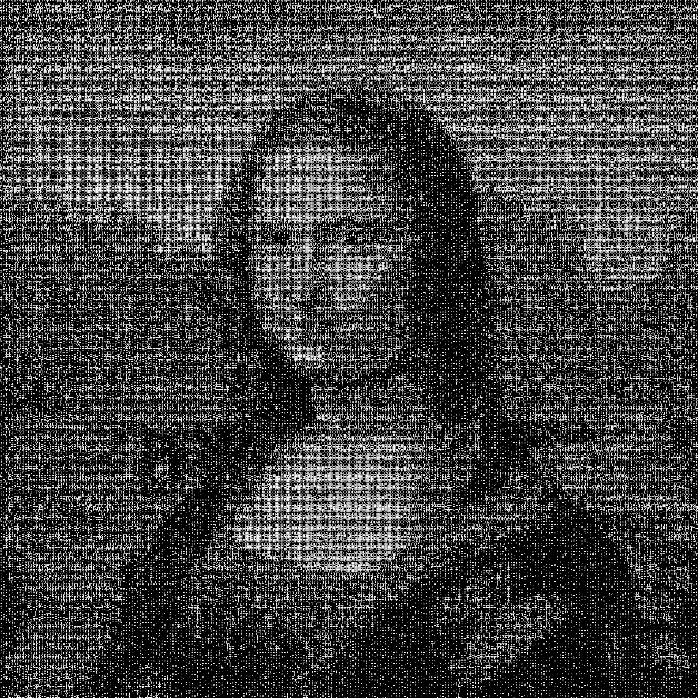
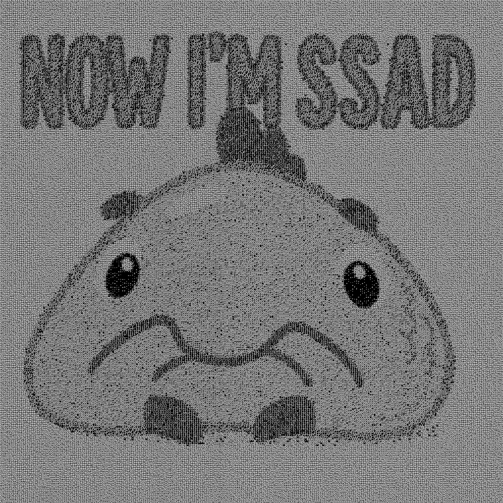

# GPU-Accelerated ASCII Art Evolutionary Algorithm

## Overview
This project implements a GPU-accelerated Evolutionary Algorithm (EA) designed to reconstruct 512x512 grayscale images using ASCII characters. Automatically generating high-quality ASCII art is framed as an optimization problem where the goal is to minimize the difference in luminance between the source image and the generated character grid. 

To overcome the slow evaluation times typical of CPU-based genetic algorithms, this implementation moves the entire evolutionary pipeline—initialization, evaluation, selection, crossover, and mutation—to the GPU. By leveraging the massive parallelism of NVIDIA GPUs using CUDA, the system maximizes throughput and achieves rapid convergence within a fixed timeframe.

## Example Outputs

Below are examples of the algorithm's output generated from the test images:

| Lena | Mona Lisa | SSAD |
|:---:|:---:|:---:|
|  |  |  |

## Algorithm Mechanics

The algorithm employs a generational approach with the following operators executed entirely as CUDA kernels:

* **Chromosome Representation:** The genome is a flat array of `unsigned char` values mapping to a predefined 69-character "ASCII Ramp" sorted by pixel greyness. The target image is divided into a grid of 256 columns.
* **Initialization:** Generates the initial population using a stateless Linear Congruential Generator (LCG) hash function based on thread index and a seed, avoiding the overhead of initializing states for standard libraries like cuRAND.
* **Selection:** Employs Tournament Selection. For each child, two parallel tournaments of size 5 are conducted, and the highest fitness individuals are selected as parents.
* **Crossover:** Utilizes Uniform Crossover, making a pseudo-random decision for every gene to inherit the allele from either Parent A or Parent B, thereby maintaining high genetic diversity.
* **Mutation (Hybrid Approach):**
    * **Exploration (15% chance):** Replaces the gene with a completely random character from the ASCII ramp to prevent stagnation in local optima.
    * **Exploitation (85% chance):** Mutates the gene by a small step (±10 greyness levels) for local search and fine-tuning.
* **Fitness Evaluation:** Fitness is calculated as the inverse of the Mean Squared Error (MSE). To compute the Sum of Squared Errors (SSE) efficiently, a Tree-Based Parallel Reduction algorithm is implemented in CUDA Shared Memory, reducing complexity from linear to logarithmic time.
* **Elitism:** Copies the top 5 best individuals directly to the next generation to ensure monotonic improvement.

## Performance & Execution

The system was originally tested on an NVIDIA GeForce GTX 1650 Ti.

* **Population Size:** 1,000 individuals.
* **Throughput:** The algorithm executes up to 120,000 epochs within a strict 600-second (10-minute) execution limit.
* **Stability:** Experimental results show high stability across multiple independent runs, with average fitness converging tightly toward the best fitness.

## Requirements

* **NVIDIA GPU** with CUDA support.
* **CUDA Toolkit** installed.
* **C++ Compiler** compatible with `nvcc`.
* `stb_image.h` (Public domain image loader by Sean Barrett, included via preprocessor definition in the source).
* Target images must be exactly **512x512 pixels** in size.

## Build and Run Instructions

1.  **Clone the repository:**
    ```bash
    git clone https://github.com/I-Leonid-I/Creative-Image-Interpreter-Intro-to-AI-Assignment
    cd ascii-evolution-cuda
    ```
2.  **Download the dependency:**
    Ensure `stb_image.h` is present in the project directory (or download it from [nothings/stb](https://github.com/nothings/stb)).
3.  **Compile the code:**
    Use `nvcc` to compile the CUDA kernel.
    ```bash
    nvcc kernel.cu -o ascii_gen -O3
    ```
4.  **Execute the program:**
    Ensure you have a 512x512 target image named `test.jpg` in a `tests/` directory (or modify the `input_image` path in `main()`).
    ```bash
    ./ascii_gen
    ```

## Output Structure

Upon completion, the program automatically generates the following:
* A `results/` directory containing `.txt` files of the best reconstructed ASCII grids.
* A `fitness_log.csv` file documenting the generation epoch, best fitness, and average fitness over time for plotting and analysis.

## Author

* **Leonid Gunko** - Innopolis University